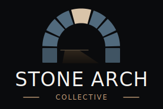

# Media Kit & Brand Guidelines

Welcome to the **Stone Arch Collective** Media Kit. This resource provides PR professionals, marketing firms, and partners with the official brand assets and usage guidelines needed to represent our organization consistently and professionally.

---

## 1. Brand Narrative
The Stone Arch Collective mark represents permanence, stability, and trust. Inspired by Roman arches that have stood for millennia, our brand symbol reflects a collective architecture: individual elements working together to create an unbreakable structure, with **artificial intelligence at the summit as the load-bearing keystone**.

*For the complete story behind our visual identity, see [About the Logo](../about.md).*

---

## 2. Logo Assets & Sizing
We provide two primary versions of our logo: a light-mode version optimized for light backgrounds, and a dark-mode version optimized for dark/black backgrounds.

### Logo Variations

| Variant | Purpose & Compatibility | Preview | Asset Link |
|:---|:---|:---:|:---|
| **Light Mode Logo** | Standard placement. Best for white, cream, or light grey backgrounds. | { width=180 } | [logo.svg](../img/logo.svg) |
| **Dark Mode Logo** | Dark mode placement. Best for dark grey, deep navy, or pure black backgrounds. | { width=180 } | [logo-dark.svg](../img/logo-dark.svg) |

!!! tip "Transparent Backgrounds"
    By default, both SVG files contain a background canvas rectangle. For transparent versions (useful for overlaying on complex layouts or images), edit the SVG files and remove or hide the `<rect id="background" ... />` element.

---

## 3. Logo Placement & Background Rules

To maintain high contrast and brand integrity, choose the correct logo variant based on the background color of your document or interface.

### Light Background Placement (Use Light Logo)
Use [logo.svg](../img/logo.svg) on backgrounds ranging from pure white to light cream (HEX `#FFF` to `#E0E0E0`).
* **Do:** Keep the surrounding space clean.
* **Don't:** Place this version on dark backgrounds, as the dark navy title text and stones will lose contrast and legibility.

### Dark Background Placement (Use Dark Logo)
Use [logo-dark.svg](../img/logo-dark.svg) on backgrounds ranging from dark grey to pure black (HEX `#252525` to `#000000`).
* **Do:** Use this version for presentations with dark themes, midnight headers, or print media with dark-colored paper.
* **Don't:** Place this version on light backgrounds, as the cream title text and slate stones will wash out.

---

## 4. Official Brand Colors

Our primary color palette is derived directly from the stone arch composition. Use these exact color specifications across digital and print media:

### Primary Brand Palette

| Color | Swatch | HEX | RGB | CMYK | Purpose |
|:---|:---:|:---|:---|:---|:---|
| **Stone Navy** |  | `#34454f` | `52, 69, 79` | `34, 13, 0, 69` | Primary arch stones (Light mode) |
| **Slate Blue** |  | `#516a7d` | `81, 106, 125` | `35, 15, 0, 51` | Primary arch stones (Dark mode) |
| **Keystone Tan** |  | `#c9b393` | `201, 179, 147` | `0, 11, 27, 21` | Keystone (central top block) |
| **Collective Gold** |  | `#c19a76` | `193, 154, 118` | `0, 20, 39, 24` | Wordmark accent rules |
| **Foundation Navy** |  | `#2b3a44` | `43, 58, 68` | `37, 15, 0, 73` | Springline foundation piers |
| **Title Navy** |  | `#202e39` | `32, 46, 57` | `44, 19, 0, 78` | Wordmark text (Light mode) |
| **Title Cream** |  | `#f5f3f0` | `245, 243, 240` | `0, 1, 2, 4` | Wordmark text (Dark mode) |

---

## 5. Clear Space & Size Restrictions

To ensure visual clarity, keep the logo free from crowding by following these layout guidelines:

* **Clear Space:** Maintain a minimum clear space of **20px** or the width of the keystone (whichever is larger) on all sides of the logo block. Do not allow text, page edges, or other graphics to intrude into this zone.
* **Minimum Digital Size:** The logo should not be displayed smaller than **120px** in width on web pages or digital presentations to preserve the legibility of the "COLLECTIVE" subtitle text.
* **Minimum Print Size:** The logo should not be printed smaller than **1.25 inches** (approx. 32mm) in width.

---

## 6. Brand Typography

The Stone Arch Collective wordmark utilizes elegant, timeless serif typefaces that evoke stability and history.

* **Primary Serif Font:** *Trajan Pro* or *Cinzel* (preferred for headlines and logo context).
* **Fallback System Serif:** *Georgia* or *Times New Roman*.
* **Body Text Font:** Standard sans-serif typography (e.g., *Roboto*, *Inter*, or standard system sans-serif) for clean readability.

---

## 7. Contact & Approvals

For co-branding designs, editorial features, custom lockups, or questions regarding logo usage, please contact:

* **Brand Manager:** Dan McCreary
* **Email / Contact:** [Dan McCreary LinkedIn](https://www.linkedin.com/in/danmccreary/) | [GitHub Profile](https://github.com/dmccreary)

!!! warning "Licensing Notice"
    The Stone Arch Collective name, logo, and brand assets are not released under open-source licenses. Always secure approval before publishing or distributing co-branded materials.
